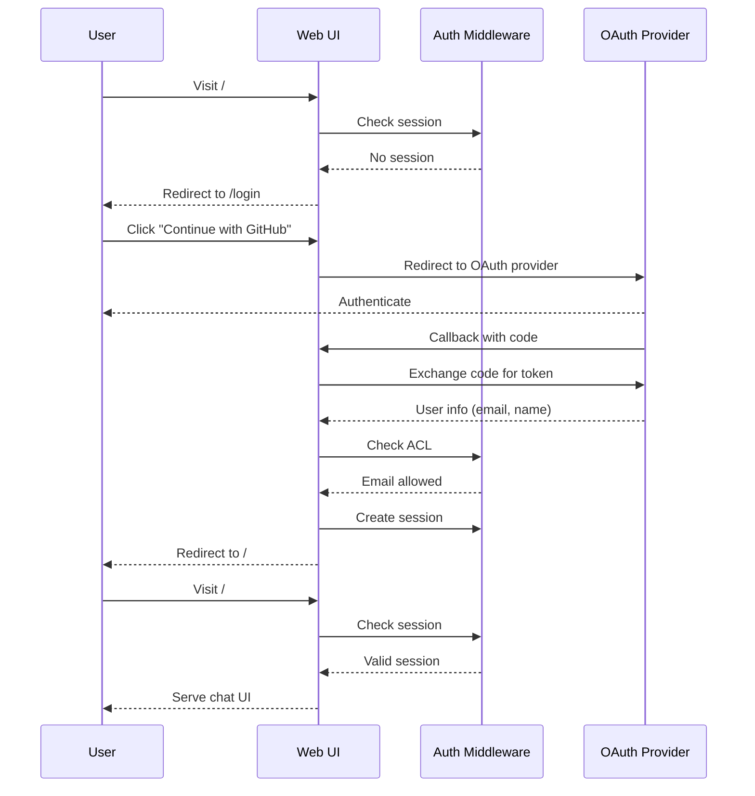

# Web UI Authentication

OmniAgent supports OAuth 2.0 SSO login for the web UI, with GitHub and Google as identity providers. When enabled, users must authenticate before accessing the chat interface while API endpoints continue to use Bearer token authentication.

## Quick Start

Enable authentication with GitHub:

```bash
export AUTH_ENABLED=true
export AUTH_SESSION_SECRET="your-32-byte-secret-key-here!!!"
export AUTH_GITHUB_CLIENT_ID="your-github-client-id"
export AUTH_GITHUB_CLIENT_SECRET="your-github-client-secret"

omniagent openai serve --web-ui --address :8080
```

Visit `http://localhost:8080/` and you'll be redirected to the login page.

## Configuration

### Required Environment Variables

| Variable | Description |
|----------|-------------|
| `AUTH_ENABLED` | Set to `true` to enable authentication |
| `AUTH_SESSION_SECRET` | Secret key for signing session cookies (min 32 bytes) |

### OAuth Provider Configuration

Configure at least one OAuth provider:

=== "GitHub"

    | Variable | Description |
    |----------|-------------|
    | `AUTH_GITHUB_CLIENT_ID` | GitHub OAuth App client ID |
    | `AUTH_GITHUB_CLIENT_SECRET` | GitHub OAuth App client secret |

=== "Google"

    | Variable | Description |
    |----------|-------------|
    | `AUTH_GOOGLE_CLIENT_ID` | Google OAuth client ID |
    | `AUTH_GOOGLE_CLIENT_SECRET` | Google OAuth client secret |

### Access Control (ACL)

Restrict access to specific users or domains:

| Variable | Description |
|----------|-------------|
| `AUTH_ALLOWED_EMAILS` | Comma-separated list of allowed email addresses |
| `AUTH_ALLOWED_DOMAINS` | Comma-separated list of allowed email domains |

!!! tip "No ACL = Allow All"
    If neither `AUTH_ALLOWED_EMAILS` nor `AUTH_ALLOWED_DOMAINS` is set, all authenticated users are allowed access.

### Additional Options

| Variable | Description | Default |
|----------|-------------|---------|
| `AUTH_COOKIE_DOMAIN` | Cookie domain for multi-subdomain setups | (auto) |
| `AUTH_BASE_URL` | Public URL for OAuth callbacks | `http://localhost:8080` |

## Setting Up OAuth Providers

### GitHub OAuth App

1. Go to [GitHub Developer Settings](https://github.com/settings/developers)
2. Click **New OAuth App**
3. Fill in the details:
   - **Application name**: OmniAgent
   - **Homepage URL**: `http://localhost:8080` (or your domain)
   - **Authorization callback URL**: `http://localhost:8080/auth/github/callback`
4. Click **Register application**
5. Copy the **Client ID** and generate a **Client Secret**

```bash
export AUTH_GITHUB_CLIENT_ID="Iv1.abc123..."
export AUTH_GITHUB_CLIENT_SECRET="your-secret..."
```

### Google OAuth

1. Go to [Google Cloud Console](https://console.cloud.google.com/apis/credentials)
2. Create a new project or select an existing one
3. Click **Create Credentials** > **OAuth client ID**
4. Select **Web application**
5. Add authorized redirect URI: `http://localhost:8080/auth/google/callback`
6. Copy the **Client ID** and **Client Secret**

```bash
export AUTH_GOOGLE_CLIENT_ID="123456789.apps.googleusercontent.com"
export AUTH_GOOGLE_CLIENT_SECRET="GOCSPX-..."
```

## Access Control Examples

### Allow Specific Users

```bash
export AUTH_ALLOWED_EMAILS="alice@example.com,bob@example.com"
```

### Allow Company Domain

```bash
export AUTH_ALLOWED_DOMAINS="@yourcompany.com"
```

### Multiple Domains + VIP Users

```bash
export AUTH_ALLOWED_EMAILS="partner@external.com,consultant@other.com"
export AUTH_ALLOWED_DOMAINS="@yourcompany.com,@subsidiary.com"
```

## Authentication Flow



## Protected vs Public Routes

When authentication is enabled:

| Path | Access |
|------|--------|
| `/` | Requires session (web UI) |
| `/login` | Public |
| `/logout` | Public |
| `/auth/*` | Public (OAuth callbacks) |
| `/health` | Public |
| `/docs` | Public |
| `/openai/v1/*` | Bearer token auth (API) |
| `/api/*` | Bearer token auth (API) |

!!! note "API Endpoints"
    API endpoints (`/openai/v1/*` and `/api/*`) continue to use Bearer token authentication as configured via `--api-key` flags. OAuth authentication only applies to the web UI.

## Production Deployment

### Generate a Strong Session Secret

```bash
# Generate a 32-byte random secret
openssl rand -base64 32
```

### HTTPS Required

In production, session cookies are set with `Secure=true`, requiring HTTPS. For local development (localhost), secure cookies are automatically disabled.

### Example Production Config

```bash
# Authentication
export AUTH_ENABLED=true
export AUTH_SESSION_SECRET="$(cat /run/secrets/session_secret)"
export AUTH_COOKIE_DOMAIN=".yourcompany.com"
export AUTH_BASE_URL="https://agent.yourcompany.com"

# OAuth Providers
export AUTH_GITHUB_CLIENT_ID="Iv1.production..."
export AUTH_GITHUB_CLIENT_SECRET="$(cat /run/secrets/github_secret)"

# Access Control
export AUTH_ALLOWED_DOMAINS="@yourcompany.com"

# API Authentication
omniagent openai serve --web-ui --api-key "$API_KEY" --address :8080
```

### Docker Deployment

```dockerfile
FROM ghcr.io/plexusone/omniagent:latest

ENV AUTH_ENABLED=true
# Secrets should be mounted at runtime, not baked into image
```

```yaml
# docker-compose.yml
services:
  omniagent:
    image: ghcr.io/plexusone/omniagent:latest
    environment:
      AUTH_ENABLED: "true"
      AUTH_SESSION_SECRET_FILE: /run/secrets/session_secret
      AUTH_GITHUB_CLIENT_ID: "Iv1.abc123"
      AUTH_GITHUB_CLIENT_SECRET_FILE: /run/secrets/github_secret
      AUTH_ALLOWED_DOMAINS: "@yourcompany.com"
    secrets:
      - session_secret
      - github_secret
    ports:
      - "8080:8080"

secrets:
  session_secret:
    file: ./secrets/session_secret.txt
  github_secret:
    file: ./secrets/github_secret.txt
```

## Session Management

Sessions are stored in secure, signed cookies with the following properties:

| Property | Value |
|----------|-------|
| Cookie Name | `omniagent_session` |
| Max Age | 7 days |
| HttpOnly | Yes |
| Secure | Yes (production) / No (localhost) |
| SameSite | Lax |

### Logout

Users can log out by visiting `/logout`, which clears the session cookie and redirects to the login page.

## Troubleshooting

### "OAuth provider not configured"

Ensure you've set both the client ID and client secret for at least one provider:

```bash
# Both are required for GitHub
export AUTH_GITHUB_CLIENT_ID="..."
export AUTH_GITHUB_CLIENT_SECRET="..."
```

### "Invalid OAuth state"

This usually means:

1. The OAuth flow took too long (state expired)
2. The user opened the login page in multiple tabs
3. Cookies are being blocked

Solution: Clear browser cookies and try again.

### "Email not allowed"

The authenticated email doesn't match the ACL. Check:

```bash
# Verify ACL settings
echo $AUTH_ALLOWED_EMAILS
echo $AUTH_ALLOWED_DOMAINS
```

### "Session secret too short"

The session secret must be at least 32 bytes:

```bash
# This is too short
export AUTH_SESSION_SECRET="short"  # Error

# This is correct (32+ bytes)
export AUTH_SESSION_SECRET="this-is-a-32-byte-secret-key!!!!"  # OK
```

### OAuth Callback URL Mismatch

Ensure the callback URL in your OAuth provider settings matches exactly:

- GitHub: `http://localhost:8080/auth/github/callback`
- Google: `http://localhost:8080/auth/google/callback`

Replace `http://localhost:8080` with your `AUTH_BASE_URL` in production.
